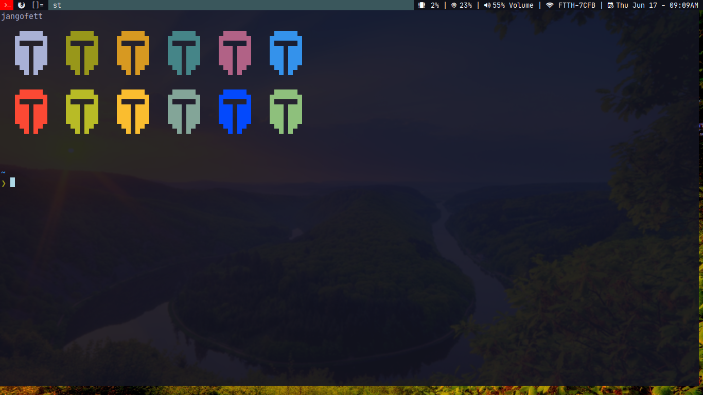

# st-ashin
my custom st build of suckless simple terminal

# installation

clone the repo. cd into it and Type this:

  `sudo make clean install`

# screenshot

## Unicode Support

## Colors Support

